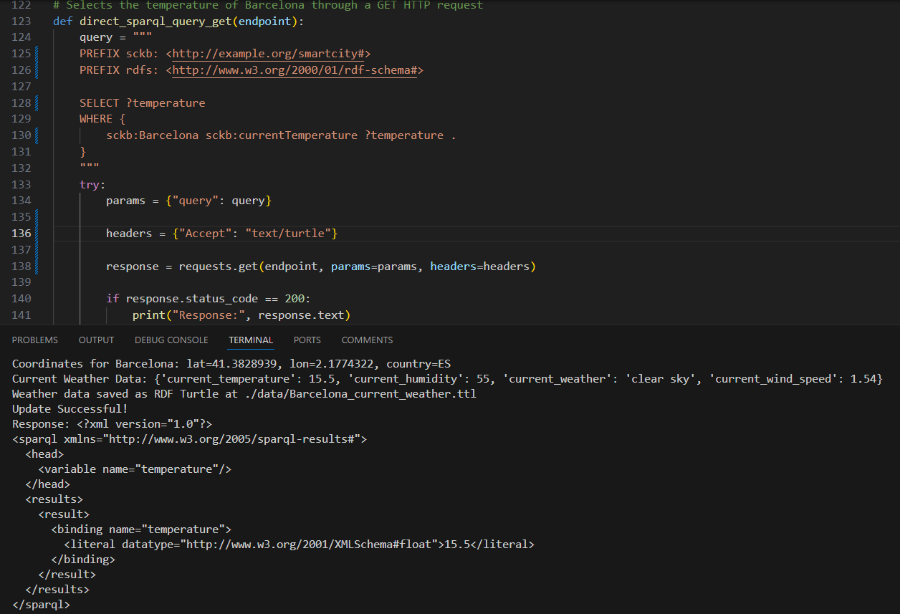

# SmartCity-KB

## Context
Smart cities face the challenge of integrating diverse data sources for **effective city management**, **decision-making**, and overall enhancing **sustainability** and **livability** of urban areas.

## Motivation
SmartCity-KB offers a solution by aggregating city-related information from **multiple sources**, including static city data, weather info, and real-time bus transportation schedules. This solution incorporates a Web Interface to provide key access points for both **machines and people** to interact.

## Data Sources

### DBpedia
- Provides static information about cities, such as name, description, geographic coordinates, and climate historical monthly data.

### OpenWeatherMap 
- Supplies real-time weather information, including current conditions and forecasts.

### Bus API
- Fetches real-time bus stop information, including location, upcoming buses, and arrival times.

## Entities and Connections

## Linked Data Principles

1. Used of URIs
2. HTTP URIs
3. Standard formats
4. Link to Other URIs

### URIs
All entities have well-defined HTTP URIs for identification.
- `http://example.org/smartcity#Barcelona`
- `http://example.org/smartcity#Barcelona/Forecast/<Forecast>`
- `http://example.org/smartcity#Barcelona/MonthlyWeatherSummary/<Month>`
- `http://example.org/smartcity#Barcelona/BusStop/<BusStop>`
- `http://example.org/smartcity#Barcelona/BusStop/<BusStop>/<BusInfo>`

Every triple has a label to provide readable information for users and queries.

**Prefixes used:**
- `@prefix sckb: <http://example.org/smartcity#>`
- `@prefix dbpedia: <http://dbpedia.org/resource/>`
- `@prefix rdfs: <http://www.w3.org/2000/01/rdf-schema#>`
- `@prefix geo1: <http://www.w3.org/2003/01/geo/wgs84_pos#>`
- `@prefix xsd: <http://www.w3.org/2001/XMLSchema#>`

The **City** Entity is liked to DBpedia resource through the prefix of DBpedia.

RDF Data is available in Turtle, JSON-LD, and XML formats.

## Data Collection and Conversion
This phase is explained on the [readme](../scripts/README.md) inside the folder scripts.

## Content Negotiation
The server processes requests for different data formats using the Accept headers provided by the client. Based on these headers, the server forwards the request to the Jena Fuseki server, which is capable of returning responses in multiple standard formats (e.g., JSON, XML, Turtle, CSV) as per the content negotiation mechanism.

### Resquest with application/json

### Request with text/turtle

### Request with application/sparql-results+xml

### Request with text/tab-separated-values

### Request with text/csv
